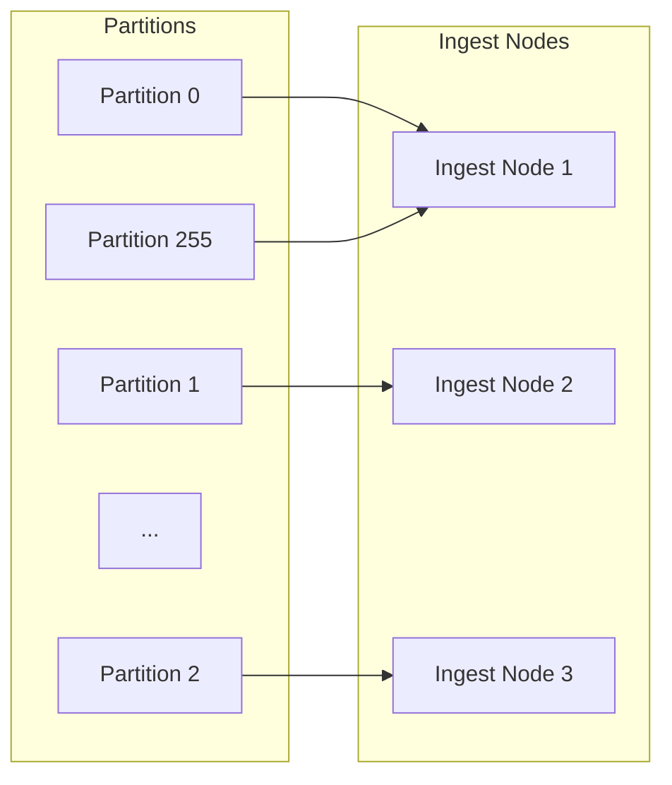
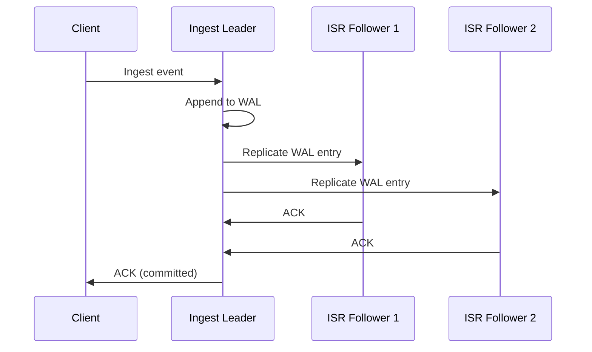

# Distributed Architecture

LynxDB scales from a single process to a 1000+ node cluster using the same binary. The distributed architecture is based on a shared-storage model where S3 is the source of truth for segment data, making compute nodes effectively stateless.

## Cluster Topology

```
┌──────────────┐    ┌──────────────┐    ┌──────────────┐
│ Meta Nodes   │    │ Ingest Nodes │    │ Query Nodes  │
│ (3-5, Raft)  │    │ (N, stateless│    │ (M, stateless│
│              │    │  except WAL) │    │  + cache)    │
│ - Shard map  │    │ - WAL write  │    │ - Scatter-   │
│ - Node reg   │    │ - Memtable   │    │   gather     │
│ - Failover   │    │ - Flush→S3   │    │ - Partial    │
│              │    │ - Replicate  │    │   merge      │
└──────┬───────┘    └──────┬───────┘    └──────┬───────┘
       │                   │                   │
       └───────────────────┼───────────────────┘
                     ┌─────┴─────┐
                     │  S3/MinIO │
                     │ (source   │
                     │  of truth)│
                     └───────────┘
```

## Node Roles

The cluster has three roles. In small clusters (< 10 nodes), every node runs all three roles. At scale, you split them for independent scaling.

### Meta Nodes (3-5)

Meta nodes manage cluster coordination and metadata:

- **Raft consensus**: Meta nodes form a Raft group (using `hashicorp/raft`) to maintain a consistent, replicated state machine.
- **Shard map**: The shard map records which ingest node owns which shard (partition). Updated atomically via Raft.
- **Node registry**: Tracks the set of live nodes, their roles, and their health status.
- **Failure detection**: Detects unresponsive nodes and triggers shard reassignment.
- **Leader election**: The Raft leader handles all writes to the cluster state. Followers serve reads and replicate the log.

Meta nodes are lightweight. 3 nodes provide fault tolerance for 1 failure; 5 nodes tolerate 2 failures. Meta nodes do not store or query log data.

### Ingest Nodes (N)

Ingest nodes handle the write path:

1. Receive ingest requests (via the REST API or compatibility endpoints).
2. Route events to the correct shard based on `fnv32a(host) % partition_count`.
3. Append events to the local WAL.
4. Insert events into the sharded memtable.
5. When the memtable flush threshold is reached, flush to a `.lsg` segment.
6. Upload the segment to S3.
7. Notify meta nodes that the segment is available.

Ingest nodes are **stateless after flush**. If an ingest node fails, its WAL is replicated (see ISR Replication below), so no data is lost. The shard is reassigned to another ingest node within seconds.

### Query Nodes (M)

Query nodes handle the read path:

1. Receive query requests via the REST API.
2. Parse and optimize the SPL2 query.
3. Determine which shards (and therefore which segments) are relevant.
4. Scatter the query to the appropriate nodes (or read segments directly from S3/cache).
5. Merge partial results from all shards.
6. Return the final result to the client.

Query nodes maintain a **local segment cache** to avoid repeatedly downloading segments from S3. The cache uses LRU eviction with a configurable size limit.

## Sharding

Data is partitioned across ingest nodes using consistent hashing.

### Partition Function

```
shard_id = fnv32a(host_field) % partition_count
```

- **fnv32a**: A fast, well-distributed 32-bit hash function.
- **host_field**: By default, events are sharded by the `host` field. This ensures all logs from the same host land on the same shard, enabling efficient per-host queries.
- **partition_count**: The total number of partitions (configurable, default 256). Partitions are assigned to ingest nodes by the meta leader.

### Partition Assignment



When nodes join or leave the cluster, partitions are rebalanced by the meta leader. The rebalancing algorithm minimizes partition movement to reduce the impact on ingest throughput.

## Replication

LynxDB uses WAL-based In-Sync Replica (ISR) replication, modeled after Apache Kafka's replication protocol.

### How ISR Works



1. The **leader** for each shard appends events to its WAL and replicates WAL entries to all followers in the ISR (In-Sync Replica set).
2. An event is **committed** when the leader and a majority of ISR followers have acknowledged it.
3. If a follower falls behind (fails to acknowledge within a timeout), it is removed from the ISR.
4. If the leader fails, the meta leader promotes an ISR follower to leader. Only followers in the ISR are eligible for promotion, ensuring no committed data is lost.

### Replication Factor

The replication factor (default 3) determines the ISR size:

| Replication Factor | Minimum Nodes | Tolerated Failures |
|-------------------|--------------|--------------------|
| 1 | 1 | 0 (no replication) |
| 2 | 2 | 0 (one must be in sync) |
| 3 | 3 | 1 |

## Distributed Query Execution

Distributed queries use the same partial aggregation engine described in [Query Engine](/docs/architecture/query-engine), extended to run across nodes.

### Scatter-Gather Pattern

```
Client query: "source=nginx | where status>=500 | stats count by uri | sort -count | head 10"

                      ┌──────────────────────┐
                      │   Query Coordinator   │
                      │   (query node)        │
                      └──────────┬───────────┘
                                 │
                    ┌────────────┼────────────┐
                    │            │            │
              ┌─────┴─────┐ ┌───┴───┐ ┌─────┴─────┐
              │  Shard 1  │ │Shard 2│ │  Shard 3  │
              │           │ │       │ │           │
              │ WHERE     │ │ WHERE │ │ WHERE     │
              │ status≥500│ │ ...   │ │ status≥500│
              │ stats cnt │ │       │ │ stats cnt │
              │ by uri    │ │       │ │ by uri    │
              │ (partial) │ │       │ │ (partial) │
              └─────┬─────┘ └───┬───┘ └─────┬─────┘
                    │           │           │
                    └────────┬──┘───────────┘
                             │
                    ┌────────┴────────┐
                    │  Global Merge   │
                    │  sort -count    │
                    │  head 10        │
                    └─────────────────┘
```

### Pipeline Splitting

The optimizer determines where to split the pipeline between shard-level (pushed) and coordinator-level (merged) execution:

**Pushable operators** (execute on shards):
- Scan, Filter (WHERE), Eval, partial STATS, partial TopK

**Coordinator operators** (execute after merge):
- Sort, Head, Tail, Join, Dedup, StreamStats, global STATS merge

The split point is the **last pushable operator** in the pipeline. Everything before it runs on shards; everything after runs on the coordinator.

### Example Split

```spl
source=nginx | where status>=500 | stats count by uri | sort -count | head 10
```

| Location | Pipeline |
|----------|----------|
| **Shard** | `scan(source=nginx) → filter(status>=500) → partial_stats(count by uri)` |
| **Coordinator** | `merge_stats → sort(-count) → head(10)` |

### TopK Optimization

When the query ends with `stats ... | sort -field | head N`, the optimizer applies TopK pushdown. Instead of computing the full aggregation and sorting, each shard maintains a min-heap of size N and streams only the top N partial results to the coordinator. This dramatically reduces network transfer for "top 10" queries on high-cardinality fields.

## Failure Handling

### Ingest Node Failure

1. The meta leader detects the failure (heartbeat timeout, default 5 seconds).
2. Removes the failed node from the node registry.
3. Reassigns its partitions to surviving ingest nodes.
4. An ISR follower is promoted to leader for each affected shard.
5. Total failover time: ~16 seconds (3 missed heartbeats + reassignment).

**Data safety**: All committed WAL entries are replicated to ISR followers. Uncommitted entries (written to the leader but not yet replicated) may be lost -- this is the trade-off of asynchronous replication. For most log workloads, losing a few seconds of data on node failure is acceptable.

### Query Node Failure

Query nodes are stateless (their segment cache is a performance optimization, not a durability requirement). If a query node fails:

1. The load balancer routes new queries to surviving query nodes.
2. Any in-flight queries on the failed node are lost and must be retried by the client.
3. No data loss occurs.

### Meta Node Failure

The Raft group tolerates `(N-1)/2` failures. With 3 meta nodes, 1 failure is tolerated. With 5 meta nodes, 2 failures are tolerated. If a majority of meta nodes are lost, the cluster cannot make coordination decisions (shard reassignment, new node joins) but existing ingest and query operations continue to function.

## Cluster Configuration

### Small Cluster (3-10 Nodes)

Every node runs all roles:

```yaml
cluster:
  node_id: "node-1"
  roles: [meta, ingest, query]
  seeds: ["node-1:9400", "node-2:9400", "node-3:9400"]

storage:
  s3_bucket: "my-logs-bucket"
```

### Large Cluster (10-1000+ Nodes)

Roles are split for independent scaling:

```yaml
# Meta node
cluster:
  node_id: "meta-1"
  roles: [meta]
  seeds: ["meta-1:9400", "meta-2:9400", "meta-3:9400"]
```

```yaml
# Ingest node
cluster:
  node_id: "ingest-14"
  roles: [ingest]
  seeds: ["meta-1:9400", "meta-2:9400", "meta-3:9400"]
```

```yaml
# Query node
cluster:
  node_id: "query-22"
  roles: [query]
  seeds: ["meta-1:9400", "meta-2:9400", "meta-3:9400"]
```

### Scaling Guidelines

| Role | Scale when | Typical ratio |
|------|-----------|---------------|
| Meta | Rarely (3 or 5 is sufficient for most clusters) | 3-5 fixed |
| Ingest | Write throughput exceeds single-node capacity (~300K events/sec/node) | 1 per 200-300K events/sec |
| Query | Query concurrency or latency exceeds acceptable thresholds | 1 per 20-50 concurrent queries |

## Related

- [Architecture Overview](/docs/architecture/overview) -- high-level system diagram
- [Storage Engine](/docs/architecture/storage-engine) -- WAL and segment flush (the ingest path)
- [Query Engine](/docs/architecture/query-engine) -- partial aggregation and pipeline splitting
- [Small Cluster Deployment](/docs/deployment/small-cluster) -- practical setup guide
- [Large Cluster Deployment](/docs/deployment/large-cluster) -- production cluster guide
- [S3 Setup](/docs/deployment/s3-setup) -- configuring the shared storage layer
