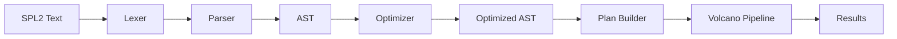

# Query Engine

The LynxDB query engine transforms SPL2 text into a streaming execution pipeline that can process millions of events per second with minimal memory overhead. It consists of four major stages: parsing, optimization, pipeline construction, and execution.

## Pipeline Overview



## SPL2 Parser

The parser is a hand-written recursive descent parser (no parser generators). This choice gives full control over error messages, error recovery, and performance.

### Lexer

The lexer (`pkg/spl2`) tokenizes the input string into a stream of tokens: keywords (`WHERE`, `STATS`, `BY`), identifiers, string literals, numbers, operators (`>=`, `!=`, `|`), and special tokens (`$` for CTEs).

### Recursive Descent Parser

The parser consumes the token stream and builds an AST (Abstract Syntax Tree). Key characteristics:

- **No backtracking**: The parser makes a single left-to-right pass over the token stream, deciding the production rule based on the current token (LL(1) where possible, with limited lookahead for ambiguous cases).
- **Error recovery**: On syntax errors, the parser attempts to recover by skipping to the next pipe (`|`) operator and continuing to parse subsequent commands. This allows reporting multiple errors in a single parse, rather than stopping at the first one.
- **Syntax suggestions**: The parser tracks context (e.g., "inside a STATS command, after BY keyword") and uses this to generate targeted suggestions when a syntax error occurs.
- **Splunk SPL1 hints**: When the parser detects Splunk SPL1 syntax that differs from SPL2, it generates a compatibility hint: `"Did you mean 'WHERE status>=500'? In SPL2, use WHERE instead of 'search status>=500'."`.

### AST

The AST represents a query as a pipeline of commands. Each command node carries its arguments:

```
Pipeline [
  SearchCommand { predicate: "source=nginx status>=500" }
  StatsCommand { aggregations: [count], groupBy: [uri] }
  SortCommand { fields: [{name: "count", desc: true}] }
  HeadCommand { limit: 10 }
]
```

CTEs are resolved during parsing. `$threats = FROM idx_backend WHERE ...` creates a named subpipeline that is substituted inline wherever `$threats` is referenced.

### Search Parser

The search predicate parser handles the first stage of an SPL2 query -- the implicit or explicit `SEARCH` command. It parses:

- Field comparisons: `status>=500`, `level="error"`, `host!=localhost`
- Boolean operators: `AND`, `OR`, `NOT`
- Parenthesized groups: `(level=error OR level=warn) AND source=nginx`
- Bare string search: `"connection refused"` (full-text search against `_raw`)
- Wildcard patterns: `host=web-*`
- Time ranges: `earliest=-1h latest=now`

## Optimizer

The optimizer transforms the AST to reduce work at execution time. It applies 23 rules in 6 ordered phases.

### Phase 1: Expression Simplification

Simplifies individual expressions without changing the pipeline structure.

| Rule | Description | Example |
|------|-------------|---------|
| **Constant folding** | Evaluate constant expressions at compile time | `WHERE 1+1 > 1` becomes `WHERE true` |
| **Dead predicate elimination** | Remove always-true predicates, short-circuit always-false | `WHERE true AND status>=500` becomes `WHERE status>=500` |
| **Boolean simplification** | Apply boolean algebra | `NOT NOT x` becomes `x` |

### Phase 2: Predicate and Projection Pushdown

Moves operators closer to the data source to reduce the number of events and columns flowing through the pipeline.

| Rule | Description | Effect |
|------|-------------|--------|
| **Predicate pushdown** | Move WHERE filters before EVAL, RENAME, and other non-filtering operators | Fewer events reach expensive operators |
| **Projection pushdown** | Push FIELDS/TABLE column lists down to the scan operator | Read only needed columns from segments |
| **Column pruning** | Remove columns that are never referenced downstream | Reduce memory and I/O |

### Phase 3: Scan Optimization

Optimizes how the scan operator reads segment files.

| Rule | Description | Effect |
|------|-------------|--------|
| **Time range pruning** | Extract time bounds from WHERE predicates and prune segments by time range | Skip segments outside the query window |
| **Bloom filter pruning** | Extract literal string terms from search predicates and check segment bloom filters | Skip segments that definitely do not contain the search term |
| **Inverted index lookup** | Convert full-text search to inverted index lookups | Read only matching rows, not the whole segment |
| **Interpolation search** | Use interpolation search instead of binary search on sorted timestamp columns | 4.4x faster than binary search (1.8ns vs 15ns) |

### Phase 4: Aggregation Optimization

Optimizes STATS and related aggregation commands.

| Rule | Description | Effect |
|------|-------------|--------|
| **Partial aggregation** | Split aggregation into per-segment partial phase and global merge phase | Reduces memory, enables distributed execution |
| **TopK pushdown** | When STATS is followed by SORT + HEAD, push the limit into a heap-based TopK aggregation | Avoids full sort for "top N" queries |
| **MV rewrite** | Detect queries that can be satisfied by a materialized view and rewrite the scan to read from the view | ~400x speedup |

### Phase 5: Expression Optimization

Optimizes the bytecode generated for expression evaluation.

| Rule | Description | Effect |
|------|-------------|--------|
| **Regex literal extraction** | Extract literal prefixes from regex patterns and use them for bloom filter pruning | Skip segments without matching prefix |
| **Common subexpression elimination** | Evaluate repeated subexpressions once and reuse the result | Fewer VM instructions |
| **Strength reduction** | Replace expensive operations with cheaper equivalents | e.g., `x * 2` becomes `x + x` |

### Phase 6: Join Optimization

Optimizes JOIN and multi-dataset operations.

| Rule | Description | Effect |
|------|-------------|--------|
| **Join predicate pushdown** | Push filters from after a JOIN into the appropriate input side | Reduce join input size |
| **Small-table broadcast** | When one join input is small (< threshold), broadcast it rather than hash-partition | Avoids expensive repartitioning |

## Volcano Iterator Pipeline

The execution engine uses the Volcano iterator model: a tree of operators where each operator implements a `Next()` method that pulls the next batch of results from its child operator.

### Pull-Based Streaming

```
Output
  ↑ Next()
Sort
  ↑ Next()
Aggregate (global merge)
  ↑ Next()
Filter (WHERE status>=500)
  ↑ Next()
Scan (segments + memtable)
```

Each `Next()` call returns a batch of up to 1024 rows. This design has critical advantages for log analytics:

- **Short-circuit**: `head 10` on 100M events reads only enough batches to fill 10 results (0.23 ms), not the entire dataset.
- **Bounded memory**: Each operator holds at most one batch in memory. A pipeline scanning 100 GB of segments uses a few MB of memory.
- **Composable**: Operators are independent and composable. Adding a new command means implementing one `Next()` method.

### Pipeline Operators (18)

| Operator | SPL2 Command | Description |
|----------|-------------|-------------|
| **Scan** | `FROM`, `SEARCH` | Reads events from segments and memtable. Applies time/bloom/index pruning. |
| **Filter** | `WHERE` | Evaluates a boolean predicate via the bytecode VM. |
| **Project** | `FIELDS`, `TABLE` | Selects a subset of columns. |
| **Eval** | `EVAL` | Computes new fields using the bytecode VM. |
| **Aggregate** | `STATS` | Hash-based aggregation with partial/global merge support. |
| **Sort** | `SORT` | In-memory sort with spill-to-disk for large result sets. |
| **Limit** | `HEAD`, `TAIL`, `LIMIT` | Limits the number of output rows. |
| **Rex** | `REX` | Regex field extraction at query time. |
| **Bin** | `BIN` | Bucket numeric/time values into discrete bins. |
| **StreamStats** | `STREAMSTATS` | Running aggregation over the event stream. |
| **EventStats** | `EVENTSTATS` | Aggregation appended to each event (no reduction). |
| **Join** | `JOIN` | Hash join between two datasets. |
| **Union** | `APPEND`, `MULTISEARCH` | Concatenates or interleaves multiple datasets. |
| **Dedup** | `DEDUP` | Removes duplicate events by specified fields. |
| **Rename** | `RENAME` | Renames fields. |
| **XYSeries** | `XYSERIES` | Pivots data into an X-Y series format. |
| **Transaction** | `TRANSACTION` | Groups events into transactions by correlation fields. |
| **Tail** | Live tail | Streams events as they arrive (SSE). |

## Bytecode VM

The bytecode VM evaluates expressions in WHERE, EVAL, and STATS commands. It is designed for extreme throughput on the hot path.

### Architecture

```
┌────────────────────────────────────┐
│          Bytecode Program          │
│  [LOAD_FIELD "status"]            │
│  [PUSH_INT 500]                   │
│  [CMP_GE]                         │
│  [HALT]                           │
├────────────────────────────────────┤
│          Execution Stack           │
│  Fixed 256 slots (no heap alloc)  │
│  [slot 0: field value]            │
│  [slot 1: constant 500]           │
│  [slot 2: comparison result]      │
├────────────────────────────────────┤
│          Field Resolver            │
│  Maps field names → column index  │
│  + current row pointer            │
└────────────────────────────────────┘
```

### Design Principles

- **Zero allocations**: The stack is a fixed-size array (256 slots) allocated once per query, not per event. No heap allocations occur during evaluation.
- **Stack-based**: Operations push and pop values on the stack. `LOAD_FIELD "status"` pushes the field value; `PUSH_INT 500` pushes the constant; `CMP_GE` pops both and pushes the boolean result.
- **Compact bytecode**: Each opcode is a single byte. The program for `status >= 500` is 4 instructions (~12 bytes).

### Opcodes (60+)

The VM supports 60+ opcodes across several categories:

| Category | Examples |
|----------|---------|
| **Stack** | `PUSH_INT`, `PUSH_FLOAT`, `PUSH_STRING`, `PUSH_BOOL`, `PUSH_NULL`, `POP`, `DUP` |
| **Field** | `LOAD_FIELD`, `STORE_FIELD` |
| **Arithmetic** | `ADD`, `SUB`, `MUL`, `DIV`, `MOD`, `NEG` |
| **Comparison** | `CMP_EQ`, `CMP_NE`, `CMP_LT`, `CMP_LE`, `CMP_GT`, `CMP_GE` |
| **Boolean** | `AND`, `OR`, `NOT` |
| **String** | `CONCAT`, `LOWER`, `UPPER`, `SUBSTR`, `LEN`, `MATCH` (regex) |
| **Type** | `TO_NUMBER`, `TO_STRING`, `IS_NULL`, `IS_NOT_NULL`, `COALESCE` |
| **Control** | `JUMP`, `JUMP_IF_FALSE`, `JUMP_IF_TRUE`, `HALT` |
| **Functions** | `CALL_IF`, `CALL_CASE`, `CALL_ROUND`, `CALL_LN`, `CALL_STRFTIME`, ... |

### Performance

| Expression | Latency | Allocations |
|-----------|---------|-------------|
| `status >= 500` | 22 ns/op | 0 |
| `status >= 500 AND host = "web-01"` | 55 ns/op | 0 |
| `IF(status>=500, "error", "ok")` | ~40 ns/op | 0 |
| `round(duration_ms / 1000, 2)` | ~35 ns/op | 0 |

At 22 ns/op, the VM can evaluate ~45 million predicates per second on a single core. In practice, I/O and pipeline overhead dominate, but the VM is never the bottleneck.

## Segment Query Cache

The query engine includes a filesystem-based segment cache that memoizes query results per segment:

- **Key**: `(segment_id, CRC32, query_hash, time_range)` -- ensures cache correctness even if the segment is rewritten by compaction.
- **Value**: Serialized partial result (e.g., partial aggregation state).
- **Eviction**: TTL (configurable) + LRU when the cache exceeds the size limit.
- **Persistence**: The cache is stored on the filesystem and survives restarts.

### Cache Hit Flow

```
Query: "level=error | stats count by source"

Segment seg_001:
  cache key = hash(seg_001, crc32, query_hash, time_range)
  → cache HIT (299ns) → return cached partial agg

Segment seg_002:
  cache key = hash(seg_002, crc32, query_hash, time_range)
  → cache MISS → scan segment → compute partial agg → cache result → return

Global merge: merge partial aggs from all segments → final result
```

For repeated queries (dashboards, alerts), the cache turns segment scans into sub-microsecond lookups.

## Partial Aggregation

Partial aggregation is a two-phase execution strategy that reduces memory usage and enables distributed query execution:

### Phase 1: Per-Segment Partial

Each segment produces a partial aggregation result. For `stats count, avg(duration) by source`:

- Each segment computes `{source: "nginx", count: 142, sum_duration: 15432.5, count_duration: 142}` locally.

### Phase 2: Global Merge

The coordinator merges all partial results:

- `count` = sum of all partial counts
- `avg(duration)` = sum of all `sum_duration` / sum of all `count_duration`

This works because count and sum are associative and commutative. All aggregation functions in LynxDB implement the `Partial` + `Merge` interface.

In distributed mode, Phase 1 runs on shard nodes and Phase 2 runs on the coordinator. See [Distributed Architecture](/docs/architecture/distributed).

## Related

- [Architecture Overview](/docs/architecture/overview) -- system-level view
- [Segment Format](/docs/architecture/segment-format) -- how the scan operator reads `.lsg` files
- [Indexing](/docs/architecture/indexing) -- bloom filters and inverted index integration
- [SPL2 Reference](/docs/spl2/overview) -- the query language that the parser implements
- [Design Decisions](/docs/architecture/design-decisions) -- why Volcano, why a bytecode VM
