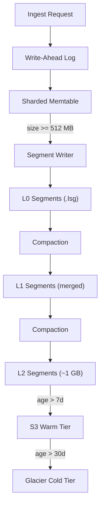

# Storage Engine

The LynxDB storage engine manages the full lifecycle of log data: ingest, durability (WAL), in-memory buffering (memtable), persistent columnar storage (segments), background maintenance (compaction), and long-term archival (tiered storage). Every component is purpose-built for log analytics -- there is no embedded RocksDB, SQLite, or other general-purpose store underneath.

## Architecture



## Write-Ahead Log (WAL)

Every event is appended to the WAL before it enters the memtable. The WAL provides crash durability: if the process terminates unexpectedly, all committed WAL entries are replayed on startup to rebuild the memtable.

### Design

- **Append-only**: Events are serialized and appended sequentially. No in-place updates, no random I/O.
- **Segment rotation**: WAL files rotate at 256 MB. Old segments are deleted after the corresponding memtable data has been flushed to `.lsg` segments.
- **Batch sync**: Rather than calling `fsync` on every write, the WAL batches syncs every 100 ms. This gives near-fsync durability with significantly higher throughput.

### Sync Policies

The WAL supports three fsync policies, configurable via `storage.wal_sync`:

| Policy | Behavior | Durability | Throughput |
|--------|----------|------------|------------|
| `none` | No explicit sync. Relies on OS page cache flush. | Data loss possible on power failure. | Highest |
| `write` | `write()` system call completes, but no `fsync`. | Durable against process crash, not power failure. | High |
| `fsync` | `fsync()` after every batch (100 ms). | Durable against power failure. | Moderate |

The default is `write`, which protects against process crashes (the most common failure mode). For workloads that require power-failure durability, use `fsync`.

### Crash Recovery

On startup, the storage engine:

1. Scans the WAL directory for segment files.
2. Reads each WAL segment sequentially, deserializing events.
3. Inserts recovered events into the memtable.
4. Skips events whose timestamps fall within already-flushed `.lsg` segments (deduplication via the segment registry).

Recovery is fast because the WAL is sequential and the memtable insertion is lock-free.

## Memtable

The memtable is an in-memory buffer that holds recently ingested events before they are flushed to columnar segments on disk.

### Sharded Design

The memtable is sharded by CPU core to enable lock-free concurrent ingestion:

```
┌──────────────────────────────────────┐
│              Memtable                │
│                                      │
│  ┌────────┐ ┌────────┐ ┌────────┐   │
│  │ Shard 0│ │ Shard 1│ │ Shard N│   │
│  │ (CPU 0)│ │ (CPU 1)│ │ (CPU N)│   │
│  │        │ │        │ │        │   │
│  │  B-tree│ │  B-tree│ │  B-tree│   │
│  └────────┘ └────────┘ └────────┘   │
│                                      │
│  Shard assignment: hash(goroutine)   │
└──────────────────────────────────────┘
```

Each shard is an ordered B-tree indexed by timestamp. Ingest goroutines are mapped to shards by hashing, so concurrent writers rarely contend on the same lock. On an 8-core machine with 8 shards, contention is effectively eliminated.

### Flush Trigger

The memtable is flushed when its total size across all shards reaches the configured threshold (default 512 MB). The flush process:

1. Freezes the current memtable (new writes go to a fresh memtable).
2. Merges all shards into a single sorted stream.
3. Writes a new `.lsg` segment via the segment writer.
4. Registers the segment in the metadata registry.
5. Truncates the WAL (removes segments that are now covered by the flushed `.lsg`).

### Two Flush Paths

The storage engine has two flush paths depending on configuration:

- **`flushToDisk`**: Writes the segment to the configured data directory. Used in server mode with `data-dir` set.
- **`flushInMemory`**: Writes the segment to an in-memory buffer. Used in pipe mode where no data directory exists.

Both paths produce identical `.lsg` segments -- the only difference is the backing store.

## Segment Files (`.lsg`)

Segments are the primary on-disk storage unit. Each segment is a self-contained columnar file in the `.lsg` V2 format containing:

- A header with metadata (version, event count, time range, column descriptors).
- Per-column data blocks with type-specific encoding.
- A bloom filter for term-level segment skipping.
- An FST-based inverted index with roaring bitmap posting lists.
- A footer with offsets to all sections.

See [Segment Format](/docs/architecture/segment-format) for a detailed breakdown of the binary format and encoding strategies.

## Compaction

Compaction merges smaller segments into larger ones to improve query performance (fewer segments to scan) and reclaim space (removing duplicate or deleted events).

### Size-Tiered Levels

LynxDB uses a three-level size-tiered compaction strategy:

```
L0 (overlapping)  →  L1 (merged, non-overlapping)  →  L2 (fully compacted, ~1 GB)
```

| Level | Segment Size | Time Ranges | Description |
|-------|-------------|-------------|-------------|
| **L0** | Small (flush-sized) | May overlap | Fresh segments from memtable flush. Many small files. |
| **L1** | Medium | Non-overlapping | L0 segments merged into larger, sorted segments. |
| **L2** | ~1 GB | Non-overlapping | Fully compacted. Optimal for scanning. |

### Compaction Process

1. **Trigger**: The compaction scheduler runs periodically (default every 30 seconds) and checks for eligible segments.
2. **Selection**: Selects L0 segments with overlapping time ranges for L0 -> L1 compaction. Selects adjacent L1 segments that together approach the L2 target size for L1 -> L2 compaction.
3. **Merge**: Opens selected segments as readers, merges events in timestamp order, writes a new segment at the target level.
4. **Swap**: Atomically registers the new segment and deregisters the old segments in the metadata registry.
5. **Cleanup**: Deletes the old segment files.

### Rate Limiting

Compaction is rate-limited to avoid starving ingest and query I/O. The `storage.compaction_workers` setting controls how many concurrent compaction jobs can run (default: 2). Compaction I/O is performed with low scheduling priority to yield to foreground operations.

## Segment Registry

The segment registry (`meta.json`) tracks all known segments, their levels, time ranges, and file paths. It is persisted atomically using a write-to-temp-then-rename pattern:

1. Write the updated registry to a temporary file.
2. Call `fsync` on the temporary file.
3. Rename (atomic on POSIX) the temporary file over `meta.json`.

This ensures the registry is never corrupted, even on power failure.

The `segmentHandle` struct wraps each segment with its reader, mmap handle, metadata, and cached bloom filter for query-time access.

## Tiered Storage

LynxDB supports automatic tiering of segments to object storage based on age:

```
Hot (local SSD, < 7d)  →  Warm (S3, < 30d)  →  Cold (Glacier, < 90d)
```

### How It Works

1. **Age policy**: The tiering scheduler checks segment ages against configured thresholds.
2. **Upload**: When a segment ages past the warm threshold, it is uploaded to S3 (or any S3-compatible store like MinIO).
3. **Eviction**: The local copy is removed after successful upload (with a configurable grace period).
4. **Query**: When a query needs a warm-tier segment, the local segment cache downloads it on demand and caches it for future queries.

### Segment Cache

The segment cache is a filesystem-based LRU cache that stores recently accessed warm-tier segments locally:

- **Max size**: Configurable via `storage.cache_max_bytes` (default 4 GB).
- **Eviction**: LRU -- least recently accessed segments are evicted when the cache is full.
- **Persistence**: The cache survives restarts. Cached segments are not re-downloaded.
- **Hit rate**: In practice, most queries hit recent data, so the cache hit rate is typically > 95%.

### ObjectStore Interface

The tiering layer uses the `ObjectStore` interface (`internal/objstore`), which has two implementations:

- **`MemStore`**: In-memory implementation for testing.
- **`S3Store`**: Production implementation backed by AWS S3 (or any S3-compatible API).

## Configuration Reference

Key storage configuration parameters:

```yaml
storage:
  compression: lz4              # Segment compression algorithm
  flush_threshold: 512mb        # Memtable flush threshold
  wal_sync: write               # WAL sync policy: none, write, fsync
  compaction_interval: 30s      # How often the compaction scheduler runs
  compaction_workers: 2         # Max concurrent compaction jobs
  cache_max_bytes: 4gb          # Warm-tier segment cache size
  s3_bucket: my-logs-bucket     # S3 bucket for warm/cold tiering
  s3_region: us-east-1          # S3 region
```

See [Storage Configuration](/docs/configuration/storage) for the complete reference.

## Related

- [Segment Format](/docs/architecture/segment-format) -- binary layout of `.lsg` V2 files
- [Indexing](/docs/architecture/indexing) -- bloom filters and inverted indexes embedded in segments
- [Query Engine](/docs/architecture/query-engine) -- how the query engine reads segments
- [S3 Tiering Configuration](/docs/configuration/s3-tiering) -- setup guide for object storage
