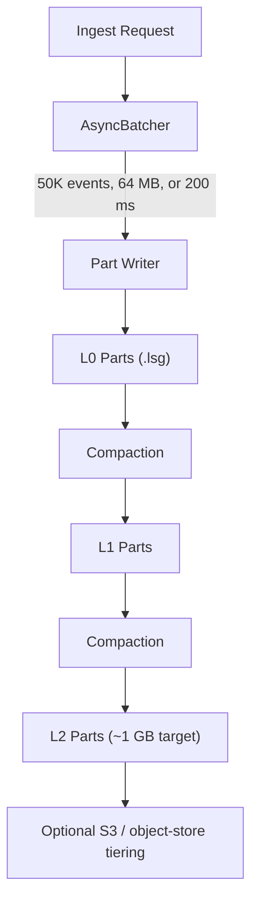

# Storage Engine

The LynxDB storage engine manages the full lifecycle of log data: ingest buffering, immutable `.lsg` part writes, background compaction, and optional remote tiering. The current write path is a direct-to-part model built around `AsyncBatcher` and atomic file renames rather than a WAL replay pipeline.

## Architecture



## AsyncBatcher and Part Writer

Incoming events are buffered per index inside `AsyncBatcher`. A shard flushes when any of these internal thresholds is crossed:

- `50,000` buffered events
- `64 MB` of raw event bytes
- `200 ms` maximum wait time

The batcher writes directly to immutable part files. There is no separate WAL directory and no replay step that rebuilds a memtable on startup.

## Commit Path

When a batch flushes, the part writer follows this sequence:

1. Serialize the batch into a temporary `tmp_*.lsg` file in the target partition directory.
2. `fsync` the file when `ingest.fsync` is enabled.
3. Close the file.
4. Atomically rename it into place as the final `.lsg` part.
5. Sync the directory entry so the rename itself is durable.
6. Register the new part in the in-memory part registry and expose it to queries.

Because the rename happens only after the write completes, queries never observe a partially written segment.

## Crash Recovery and Durability

Startup recovery is filesystem-driven:

1. Scan index partition directories.
2. Delete stale `tmp_*` and `.deleted` files left behind by interrupted writes or compactions.
3. Read the footers of surviving `.lsg` files.
4. Rebuild the in-memory part registry from those on-disk parts.

This model has an important durability tradeoff: events accepted into the in-memory batcher are not durable until the part write commits. If the process or host fails before the flush completes, those buffered events can be lost. Clients that need at-least-once delivery should retry on connection loss or other uncertain outcomes.

## Part Files (`.lsg`)

Parts are the primary storage unit. Each part is a self-contained columnar `.lsg` file with:

- per-column encoded data blocks
- bloom filters and inverted indexes for pruning
- metadata such as time range, event count, level, and tier
- footer data that lets the registry reconstruct part metadata on startup

See [Segment Format](/docs/architecture/segment-format) for the detailed on-disk layout.

## Compaction

Compaction merges smaller parts into larger ones to reduce scan fan-out and reclaim space from superseded files.

LynxDB uses a three-level size-tiered strategy:

```
L0 (fresh flushes)  →  L1 (merged)  →  L2 (larger compacted parts)
```

| Level | Description |
|---|---|
| `L0` | Freshly flushed parts; time ranges may overlap |
| `L1` | Merged parts with less fan-out |
| `L2` | Larger compacted parts near the configured target size |

The compaction scheduler runs periodically, writes replacement parts, swaps them into the registry, and retires the old files.

## Part Registry

The filesystem is the source of truth. LynxDB does not keep a separate `meta.json` registry for parts.

The in-memory registry is rebuilt from disk on startup and tracks:

- part ID
- index and partition
- time range
- size and event count
- compaction level
- tier and object-store key

This keeps crash recovery simple: if the part is present on disk and readable, it can be re-registered.

## Tiered Storage

When object storage is configured, the background tiering loop evaluates segment age on `storage.tiering_interval` and promotes data across storage tiers:

```
Hot (local disk)  →  Warm (object store)  →  Cold (object store / archive policy)
```

What is automated:

- age-based evaluation of eligible segments
- upload from hot to warm object storage
- warm-to-cold key migration in the object store
- lazy fetch into the local segment cache for remote reads

What remains operator-controlled:

- the object-store backend itself
- optional bucket lifecycle rules if you want S3 Glacier or Deep Archive underneath the cold tier

## Configuration Reference

Common settings for the current storage path:

```yaml
storage:
  compression: lz4
  compaction_interval: 30s
  compaction_workers: 2
  l0_threshold: 4
  l1_threshold: 4
  l2_target_size: 1gb
  s3_bucket: my-logs-bucket
  s3_region: us-east-1

ingest:
  fsync: true
  max_body_size: 100mb
  max_batch_size: 1000
```

See [Storage Settings](/docs/configuration/storage), [Ingest Settings](/docs/configuration/ingest), and [S3 Tiering](/docs/configuration/s3-tiering) for the full operator-facing configuration surface.

## Related

- [Segment Format](/docs/architecture/segment-format)
- [Indexing](/docs/architecture/indexing)
- [Query Engine](/docs/architecture/query-engine)
- [S3 Tiering](/docs/configuration/s3-tiering)
