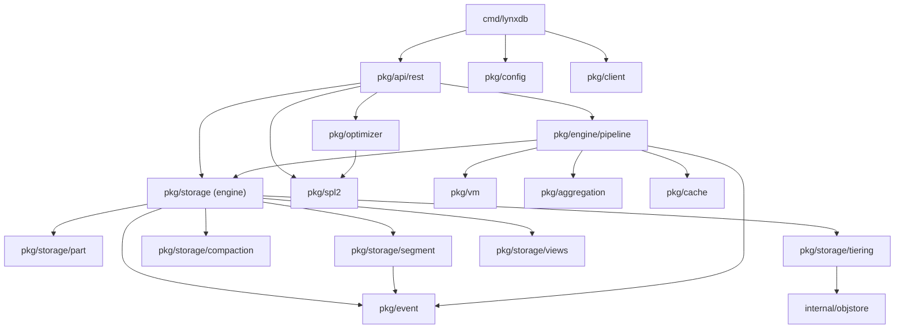

# Project Structure

LynxDB follows standard Go project layout conventions. This page describes every package and its role in the system.

## Top-Level Layout

```
lynxdb/
├── cmd/lynxdb/           # CLI entry point
├── pkg/                  # Public packages (the core of LynxDB)
├── internal/             # Private packages (not importable outside the module)
├── test/                 # Test suites
├── docs/                 # Documentation site (Docusaurus)
├── go.mod                # Go module definition
├── go.sum                # Dependency checksums
├── Makefile              # Build and test targets
└── CLAUDE.md             # Project overview and architecture reference
```

## `cmd/lynxdb/` -- CLI Entry Point

The `cmd/lynxdb/` directory contains the `main` package and the CLI command definitions. Each subcommand (`server`, `query`, `ingest`, `status`, `mv`, `config`, `bench`, `demo`) is defined here and delegates to the appropriate `pkg/` package.

```
cmd/lynxdb/
├── main.go               # Entry point, root command
├── server.go             # `lynxdb server` command
├── query.go              # `lynxdb query` command
├── ingest.go             # `lynxdb ingest` command
├── status.go             # `lynxdb status` command
├── mv.go                 # `lynxdb mv` (materialized views) command
├── config.go             # `lynxdb config` command
├── bench.go              # `lynxdb bench` command
├── demo.go               # `lynxdb demo` command
└── completion.go         # Shell completion generation
```

This layer is intentionally thin -- it parses flags, sets up configuration, and calls into `pkg/`.

## `pkg/` -- Core Packages

### `pkg/api/rest/` -- HTTP Server and REST API

The REST API layer. Contains the HTTP server, all endpoint handlers, middleware (auth, logging, rate limiting), and the response envelope format.

Key responsibilities:
- HTTP server lifecycle (start, shutdown, TLS).
- Route registration for all `/api/v1/` endpoints.
- Request parsing and validation.
- Response serialization (JSON, NDJSON, SSE).
- The compatibility layer (Elasticsearch `_bulk`, OTLP, Splunk HEC).

See [REST API Overview](/docs/api/overview) for the user-facing API documentation.

### `pkg/spl2/` -- SPL2 Query Language

The SPL2 lexer, parser, AST definitions, search predicate parser, and Splunk SPL1 compatibility hint generator.

```
pkg/spl2/
├── lexer.go              # Tokenizer
├── parser.go             # Recursive descent parser
├── ast.go                # AST node types
├── search.go             # Search predicate parser (field=value, boolean, wildcards)
├── compat.go             # SPL1 → SPL2 compatibility hints
└── errors.go             # Parse error types with suggestions
```

Key responsibilities:
- Convert SPL2 text to a typed AST.
- Error recovery (report multiple errors per query).
- Syntax suggestions for common mistakes.
- Detect SPL1 syntax and suggest SPL2 equivalents.

See [Query Engine](/docs/architecture/query-engine) for how the parser fits into the query pipeline.

### `pkg/engine/pipeline/` -- Volcano Iterator Pipeline

The streaming query execution engine. Implements the Volcano iterator model with 18 operators.

```
pkg/engine/pipeline/
├── pipeline.go           # Pipeline builder (AST → operator tree)
├── scan.go               # Scan operator (reads .lsg parts + batcher buffer)
├── filter.go             # Filter operator (WHERE)
├── project.go            # Project operator (FIELDS, TABLE)
├── eval.go               # Eval operator (EVAL)
├── aggregate.go          # Aggregate operator (STATS, partial + global)
├── sort.go               # Sort operator (SORT)
├── limit.go              # Limit operator (HEAD, TAIL, LIMIT)
├── rex.go                # Rex operator (REX regex extraction)
├── bin.go                # Bin operator (BIN)
├── streamstats.go        # StreamStats operator (STREAMSTATS)
├── eventstats.go         # EventStats operator (EVENTSTATS)
├── join.go               # Join operator (JOIN)
├── union.go              # Union operator (APPEND, MULTISEARCH)
├── dedup.go              # Dedup operator (DEDUP)
├── rename.go             # Rename operator (RENAME)
├── xyseries.go           # XYSeries operator (XYSERIES)
├── transaction.go        # Transaction operator (TRANSACTION)
└── tail.go               # Tail operator (live tail streaming)
```

Each operator implements the `Operator` interface with a `Next()` method that returns the next batch of rows.

### `pkg/optimizer/` -- Query Optimizer

The 23-rule query optimizer. Transforms the AST to reduce work at execution time.

Key responsibilities:
- Expression simplification (constant folding, boolean algebra).
- Predicate and projection pushdown.
- Scan optimization (time range pruning, bloom filter pruning, inverted index lookup).
- Aggregation optimization (partial aggregation, TopK pushdown, MV rewrite).
- Expression optimization (regex literal extraction, CSE).
- Join optimization.

See [Query Engine -- Optimizer](/docs/architecture/query-engine#optimizer) for the full rule list.

### `pkg/vm/` -- Bytecode VM

The stack-based bytecode VM for evaluating expressions in WHERE, EVAL, and STATS commands.

Key responsibilities:
- Compile AST expressions to bytecode programs.
- Execute bytecode with zero heap allocations.
- 60+ opcodes for arithmetic, comparison, boolean logic, string operations, and function calls.

See [Query Engine -- Bytecode VM](/docs/architecture/query-engine#bytecode-vm) for architecture details.

### `pkg/storage/` -- Storage Engine

The core storage engine package. Contains the top-level `Engine` type that coordinates async ingest buffering, immutable part files, segment management, compaction, and tiering.

```
pkg/storage/
├── part/                 # Async batcher, part writer, and filesystem registry
├── segment/              # Columnar .lsg format
├── compaction/           # Size-tiered compaction
├── tiering/              # Hot/warm/cold with S3 offload
└── views/                # Materialized views
```

#### `pkg/storage/segment/` -- Segment Reader and Writer

The columnar `.lsg` segment format implementation.

Key files:
- `writer.go` -- Segment writer (always produces V2 format).
- `reader.go` -- Segment reader (accepts V1 and V2).
- `mmap.go` -- Memory-mapped segment access via `MmapSegment`.
- `encoding.go` -- Per-column encoding (delta-varint, dictionary, Gorilla, LZ4).
- `bloom.go` -- Bloom filter construction and querying.
- `index.go` -- FST inverted index construction and querying.
- `footer.go` -- Footer decoding (`decodeFooter` returns `(*Footer, uint16, error)`).

See [Segment Format](/docs/architecture/segment-format) for the binary format specification.

#### `pkg/storage/part/` -- Direct-to-Part Writes

Implements the async batcher, immutable part writer, and filesystem-scanned registry used by the current ingest path.

#### `pkg/storage/compaction/` -- Compaction

Size-tiered compaction engine. Merges L0 -> L1 -> L2 segments. Rate-limited to avoid I/O starvation.

#### `pkg/storage/tiering/` -- Tiered Storage

Manages the lifecycle of segments across storage tiers: hot (local SSD), warm (S3), cold (Glacier). Includes the local segment cache for warm-tier queries.

#### `pkg/storage/views/` -- Materialized Views

Materialized view lifecycle: definition, query dispatch, backfill, incremental update, merge, and retention.

### `pkg/event/` -- Core Event Type

Defines the `Event` type (the unit of data flowing through the system) and an event pool for allocation reuse.

### `pkg/model/` -- Configuration and Errors

Shared types for configuration, index definitions, and structured error types.

### `pkg/config/` -- Configuration Loading

Loads configuration from the cascade: CLI flags > environment variables > config file > defaults. Supports hot-reload for a subset of settings.

### `pkg/cache/` -- Segment Query Cache

Filesystem-based segment query cache. Key = `(segment_id, CRC32, query_hash, time_range)`. TTL + LRU eviction. Persistent across restarts.

### `pkg/ingest/` -- Ingest Pipeline

```
pkg/ingest/
├── pipeline/             # Ingest pipeline (parse, extract timestamps, route)
├── receiver/             # HTTP and OTLP receivers
└── parser/               # Log format auto-detection (JSON, syslog, CLF, raw)
```

Handles the ingest path from raw bytes to structured events ready for the storage engine.

### `pkg/aggregation/` -- Aggregation Functions

Implementations of all aggregation functions: `count`, `sum`, `avg`, `min`, `max`, `dc` (distinct count), `values`, `stdev`, `perc50/75/90/95/99`, `earliest`, `latest`. Each function implements the `Partial` + `Merge` interface for distributed execution.

### `pkg/alerts/` -- Alert Engine

Alert evaluation loop plus the currently wired notification channel implementations (`webhook`, `slack`, `telegram`).

### `pkg/client/` -- Go Client Library

A Go HTTP client for the LynxDB REST API. Used by the CLI in server mode and available for external integrations.

### `pkg/timerange/` -- Time Range Utilities

Parsing and manipulation of time ranges. Handles relative expressions (`-1h`, `earliest=-7d latest=now`) and absolute timestamps.

## `internal/` -- Private Packages

### `internal/objstore/` -- Object Store Interface

The `ObjectStore` interface abstracts object storage. Two implementations:

- `MemStore` -- In-memory implementation for testing.
- `S3Store` -- Production implementation backed by AWS S3 (or S3-compatible APIs like MinIO).

### `internal/output/` -- CLI Output Formatting

Formatters for CLI output: JSON (default), table (human-readable), CSV, and raw (plain text). Auto-detects TTY vs pipe to choose between interactive and machine-readable formats.

## `test/` -- Test Suites

```
test/
├── acceptance/           # 10 canonical queries with expected results
├── integration/          # HTTP API integration tests
├── e2e/                  # End-to-end tests (CLI invocation → results)
└── regression/           # Bug fix regression tests
```

- **Acceptance tests**: Run 10 carefully chosen queries against a fixed test dataset and verify exact result correctness. These are the "golden" tests that must pass before any release.
- **Integration tests**: Start a real HTTP server and exercise the REST API endpoints.
- **E2E tests**: Invoke the `lynxdb` CLI binary as a subprocess and verify output.
- **Regression tests**: Each test corresponds to a specific bug fix and ensures the bug does not reappear.

## Dependency Graph

The following diagram shows the primary dependency relationships between core packages:



## Related

- [Development Setup](/docs/contributing/development-setup) -- build and run the project
- [Coding Guidelines](/docs/contributing/coding-guidelines) -- style conventions
- [Architecture Overview](/docs/architecture/overview) -- how the system fits together
