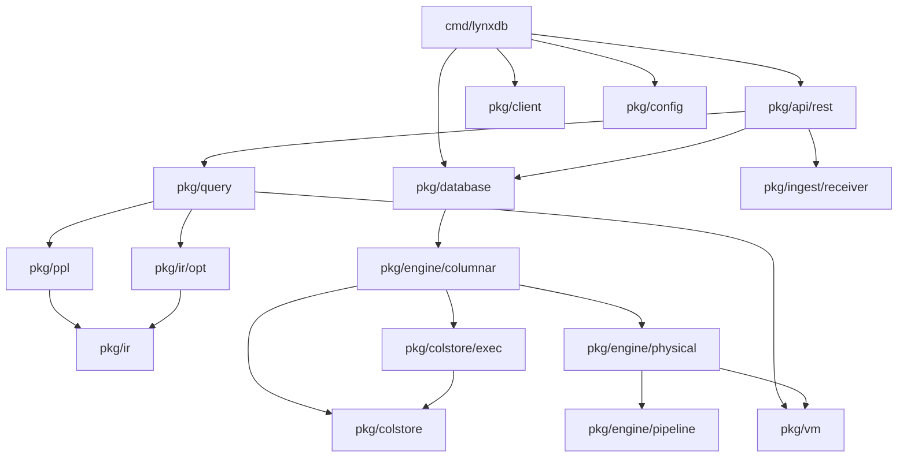

# Project Structure

LynxDB follows the standard Go project layout. This page describes each package and its role.

## Top-Level Layout

```
lynxdb/
├── cmd/            # Binaries: the lynxdb CLI and server
├── pkg/            # Core packages
├── internal/       # Packages private to the module
├── test/           # End-to-end, CLI and regression tests
├── testdata/       # Sample logs and fixtures
├── scripts/        # Install, release, profiling and benchmark helper scripts
├── docs/           # Documentation site (Docusaurus)
├── go.mod, go.sum  # Module definition
├── mise.toml       # Pinned toolchain (Go, golangci-lint, goreleaser, ...)
└── Makefile        # Build, test and lint targets
```

## `cmd/`

### `cmd/lynxdb/` -- CLI and Server

The `main` package and the CLI commands, built with Cobra:

| File | Command |
|------|---------|
| `root.go`, `main.go` | Root command, global flags, exit codes |
| `server.go` | `lynxdb server` |
| `query.go` | `lynxdb query` (server mode, and file and pipe mode in process) |
| `explain.go` | `lynxdb explain` |
| `fields.go` | `lynxdb fields` |
| `ingest.go`, `import.go` | `lynxdb ingest`, `lynxdb import` |
| `status.go` | `lynxdb status`, `health`, `indexes` |
| `jobs.go` | `lynxdb jobs` |
| `config.go` | `lynxdb config` and its subcommands |
| `authcmd.go`, `login.go`, `logout.go` | `lynxdb auth`, `login`, `logout` |
| `completion.go`, `completions.go` | Shell completion |
| `version.go` | `lynxdb version` |

This layer parses flags, loads configuration, and calls into `pkg/`. `CLI.md` in the directory is the reference of every command and flag.

## `pkg/` -- Query Language

### `pkg/ppl/` -- PPL Frontend

Compiles OpenSearch Piped Processing Language into the IR.

```
pkg/ppl/
├── lexer/        # Tokens with line and column, following the official PPL lexer rules
├── parser/       # Hand-written recursive-descent parser
├── ast/          # Syntax tree with source spans
├── grok/         # Grok pattern library, expanded to RE2 at compile time
├── compile.go    # Entry point: parse, analyze, lower, validate
├── commands.go, commands_more.go, chart.go, join.go, search.go, exprs.go, timespec.go
│                 # Semantic analysis and lowering of each command and expression
├── catalog.go    # Command catalog: support level and notes per command
├── functions.go, relevance.go   # Scalar function catalog
├── aggs.go       # Aggregation catalog
└── errors.go     # Structured errors with codes, positions and hints
```

See [PPL architecture](../ppl/architecture.md), [Adding commands](../ppl/adding-commands.md) and [Adding functions](../ppl/adding-functions.md).

### `pkg/ir/` -- Intermediate Representation

The typed, language-independent plan: operators, expressions, schemas, types, the function registry, validation (`ir.Validate`), walking, and rendering for `explain`. See [PPL IR](../ppl/ir.md).

### `pkg/ir/opt/` -- Optimizer

Rule-based rewrites over IR plans (`fold-constants`, `merge-filters`, `remove-true-filter`, `prune-scan`, `time-range-to-scan`, `sort-limit-to-topn`, `limit-into-scan`) and column pruning. See [PPL optimizer](../ppl/optimizer.md).

### `pkg/query/` -- Compile

The single entry point that turns query text into an optimized plan: `Compile` (frontend, optimizer, validation, a cache of recent plans), `Fold` for constant folding with the VM, and `Explain`.

## `pkg/` -- Storage and Execution

### `pkg/database/` -- Database

The database of a server and of pipe mode: one columnar store per index under the data directory, `Append`, `Sync` and `Query`, query jobs (`jobs.go`) with their states and time to live, and retention. See [Storage](../architecture/storage.md).

### `pkg/engine/columnar/` -- Running Plans

Opens each index with its saved settings (`db.go`, `settings.go`) and runs IR plans over the stores: it hands every part of a plan that the columnar executor takes to `pkg/colstore/exec`, turns small subqueries into lists of values, and runs the rest with the row operators. See [Query Engine](../architecture/query-engine.md).

### `pkg/colstore/` -- Columnar Store

```
pkg/colstore/
├── store.go, store_run.go  # Store: buffers, flushes into sorted runs, merges, partitions, retention
├── dir.go                  # Part files and the manifest of a store's directory; recovery
├── table.go, scan.go       # Snapshots of the live parts and parallel block scans
├── ordered.go              # Key ranges over parts sorted by a key
├── part/                   # Immutable columnar parts: blocks, encodings, footer, token filter pages
├── shred/                  # JSON documents parsed straight into typed column builders
├── variant/                # Binary encoding for JSON values without a column of their own
├── tokenfilter/            # Search tokens and per-block token fingerprints
└── exec/                   # Columnar executor over snapshots; exec/irplan plans IR onto it,
                            # exec/irfunc implements IR functions over columns
```

`pkg/vec` holds typed column vectors and the kernels over them; `pkg/mem` holds region allocators, pools and the bound on garbage awaiting collection.

### `pkg/engine/physical/` -- Physical Planner

Turns IR operators into pipeline iterators, compiles IR expressions to VM programs, and evaluates uncorrelated subqueries before the operators that use them.

### `pkg/engine/pipeline/` -- Row Operators

The iterator interface (`Init`, `Next`, `Close`) and the operators: row scans, filter and eval, aggregation, sort and top-N, joins, unions, dedup, window operators (`eventstats.go`, `streamstats.go`), time buckets and extraction. Batches hold up to 1024 rows.

### `pkg/vm/` -- Bytecode VM

Compiles IR expressions to bytecode (`ir_compiler.go`) and runs them on a fixed 256-slot stack, with native implementations of every function in the IR registry.

## `pkg/` -- Server and Ingest

### `pkg/api/rest/` -- HTTP API

The HTTP server: route registration (`server.go`), handlers for query, explain, jobs, ingest, the Elasticsearch, OTLP and Splunk HEC protocols, fields, histogram, status, config and auth, plus middleware and the response envelope. `pkg/api/apicontracts` holds query request constants that the handlers use and a test checks against the docs.

### `pkg/ingest/` -- Ingest Path

```
pkg/ingest/
├── ndjson/       # Events and log text written as NDJSON lines for the database
├── pipeline/     # Ingest stages: format detection, field extraction, timestamps
├── receiver/     # Elasticsearch (eshttp), OTLP (otlphttp, otlpgrpc, otlpcommon), Splunk HEC, syslog
└── limits/       # Request body size limits for shipper endpoints
```

### Shared Packages

| Package | Purpose |
|---------|---------|
| `pkg/event` | The `Event` type and typed `Value` |
| `pkg/config` | Configuration cascade (flags > env > file > defaults), validation, hot reload |
| `pkg/stats` | Query statistics for the CLI |
| `pkg/auth` | API keys, credential files, TLS helpers |
| `pkg/client` | Typed Go client for the REST API, used by the CLI |
| `pkg/timerange` | Parsing of relative and absolute time ranges |

## `internal/`

| Package | Purpose |
|---------|---------|
| `internal/docgen` | Writes the generated PPL reference pages (`docs/site/docs/ppl/commands.md`, `functions.md`, `aggregations.md`) from the catalogs; run `go run ./internal/docgen` or `make docs-gen` |
| `internal/output` | Result formatters for the CLI (JSON, NDJSON, table, CSV, TSV, raw, ...) |
| `internal/ui` | CLI theme and rendering components |
| `internal/buildinfo` | Version, commit and build date injected with `-ldflags` |
| `internal/glob` | Glob matching (`*`, `**`, `?`, classes, braces) |

## `test/`

```
test/
├── e2e/          # Server tests over the REST API; e2e/shippers runs real shippers in containers
├── cli/          # Tests against the built binary: pipe and file mode, exit codes, goldens
└── regression/   # Query correctness regressions
```

- **E2E**: `make test-e2e`; shipper compatibility with `make test-compat` and the nightly [conformance matrix](/docs/operations/shipper-conformance).
- **CLI**: `make test-cli` builds the binary and runs `test/cli` with the `clitest` tag.
- **Regression**: each test pins a fixed bug.

## Dependency Graph


```mermaid
flowchart TD
    CMD["cmd/lynxdb"] --> API["pkg/api/rest"]
    CMD --> CLIENT["pkg/client"]
    CMD --> CONFIG["pkg/config"]
    CMD --> DB["pkg/database"]

    API --> DB
    API --> QUERY["pkg/query"]
    API --> RECV["pkg/ingest/receiver"]

    DB --> COLUMNAR["pkg/engine/columnar"]
    QUERY --> PPL["pkg/ppl"]
    QUERY --> OPT["pkg/ir/opt"]
    QUERY --> VM["pkg/vm"]
    PPL --> IR["pkg/ir"]
    OPT --> IR

    COLUMNAR --> COLSTORE["pkg/colstore"]
    COLUMNAR --> EXEC["pkg/colstore/exec"]
    COLUMNAR --> PHYSICAL["pkg/engine/physical"]
    PHYSICAL --> PIPELINE["pkg/engine/pipeline"]
    PHYSICAL --> VM
    EXEC --> COLSTORE
```

## Related

- [Development Setup](/docs/contributing/development-setup) -- build and run the project
- [Coding Guidelines](/docs/contributing/coding-guidelines) -- style conventions
- [Architecture Overview](/docs/architecture/overview) -- how the system fits together
